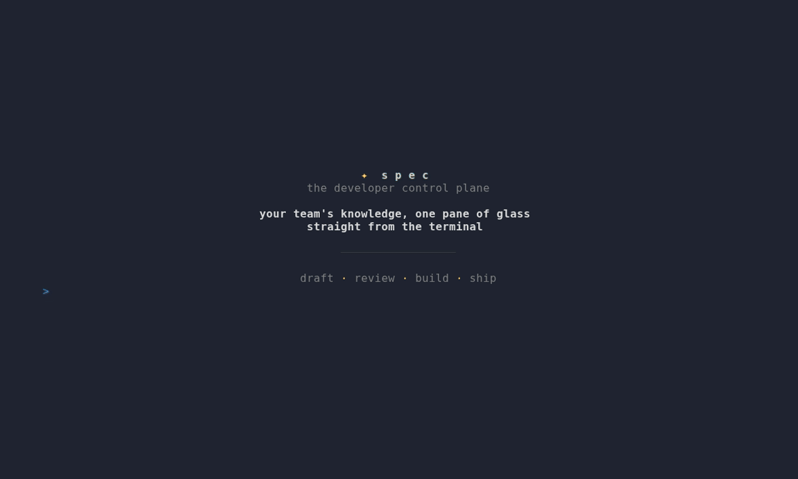

# spec — Work _flow_ in the Terminal

`spec` was built for flow. Born out of desire to escape the tangled webs of
development lifecycle software — free to solve problems in peace and serenity.

It keeps spec documents, pipeline state, decisions, review context, and build
context in one workflow.

Run `spec` with no arguments to open the interactive terminal dashboard. The
dashboard is the primary interface for day-to-day work: triage incoming items,
read specs, advance stages, review work, and start builds from one keyboard-driven
view. The same actions are also available as commands for scripts, CI, and
automation.



> **New here?** Start with the **[QUICKSTART guide →](docs/QUICKSTART.md)**.

---

## Why spec?

- **A terminal-first workflow.** A streamlined TUI is the primary surface:
  six tabs, keyboard navigation, drill-down spec reading and inline actions for
  triage, stage changes, reviews, and builds. Commands provide the same operations
  for scripting and CI.
- **One place for the work.** Specs, pipeline state, decisions, reviews, and build
  context live together.
- **Configurable pipeline state.** Stages, gates, and automated effects are
  config-driven. Start from a preset and adjust it as your process changes.
- **Markdown in git as the source of truth.** No proprietary database, no lock-in.
  A spec is a structured `SPEC-NNN.md` you can read, diff, and review.
- **Local-first and resilient.** Every integration is optional. Unconfigured tools
  use noop adapters. `spec` works fully offline.
- **Agent build context.** `spec build` assembles structured context for coding agents
  (Pi, Claude Code, Cursor, Copilot) over an MCP server or a context file.
- **AI is optional.** Drafting features are available when configured; the core
  workflow works without them.

---

## Install

### Homebrew

```bash
brew install aaronl1011/tap/spec
```

### Go install

Requires Go 1.25+.

```bash
go install github.com/aaronl1011/spec@latest
```

### Prebuilt binaries

Download from [GitHub Releases](https://github.com/aaronl1011/spec/releases) for
linux/amd64, linux/arm64, darwin/amd64, darwin/arm64, and windows/amd64.

### Build from source

```bash
git clone https://github.com/aaronl1011/spec.git
cd spec
make build      # → ./bin/spec
```

Verify:

```bash
spec version
spec --help
```

### Shell completions & man pages

```bash
make install              # build + install to ~/.local/bin
make install-completions  # auto-detects bash / zsh / fish
make install-man          # install man pages (spec(1), spec-advance(1), …)
```

---

## The 30-second tour

Set up once, then open the dashboard:

```bash
spec config init --user        # set up your identity (once)
spec join acme/specs           # join your team's specs repo
spec                           # open the interactive dashboard
```

Inside the dashboard, use the keyboard to read and act on work: `enter` opens a
spec, `a` advances it, `b` starts or resumes a build, `f` toggles focus, and `n`
creates a new spec. The same operations are available as commands:

```bash
spec new --title "Auth fix"    # scaffold a spec
spec focus SPEC-042            # set your working context
spec advance                   # advance through the pipeline
spec do                        # resume where you left off
```

Once you `spec focus` a spec, most commands infer the ID automatically — no need to
repeat it. The full walkthrough lives in the **[QUICKSTART guide →](docs/QUICKSTART.md)**.

---

## Core concepts

### The spec

A `SPEC-NNN.md` is a structured markdown document with YAML frontmatter and
role-scoped sections. `<!-- owner: role -->` markers define who can write to each
section, which powers section-scoped sync (a PM edits the problem statement in
Confluence, an engineer edits the technical plan in the terminal) and gate
validation (you can't advance past design if the design inputs are empty).

### The pipeline

Specs flow through configurable stages — each with an owner role, gates that must
pass before advancing, and effects that fire on transition (notify a channel, sync
to docs, log a decision). Start from a preset (`minimal`, `startup`, `product`,
`platform`, `kanban`) and customise from there.

### Focus mode

Most commands operate on a single spec. Set a focused spec once with `spec focus`
and it persists across terminal sessions. Commands such as `spec status`,
`spec advance`, and `spec build` use the focused spec unless you pass an explicit
ID.

### Interfaces

`spec` exposes the same workflow through two interfaces.

**The dashboard (TUI)** — running `spec` in an interactive terminal launches a
persistent, auto-refreshing dashboard with six tabs: **Dashboard, Pipeline, Specs,
Triage, Reviews, Settings**. It supports keyboard navigation, drill-down spec
reading, inline lifecycle actions (advance, revert, block, focus, build, decide,
push, sync, archive), and a role-gated triage flow (open a detail view, add notes,
edit, close, escalate, promote to a spec). Settings are editable live. Destructive
actions require confirmation.

**The command interface** — every dashboard action is also a first-class command,
so the workflow can run from scripts, hooks, and CI. In non-interactive
contexts (pipes, CI) the dashboard falls back to a static render; force it anywhere
with `--static`.

For the complete command reference, configuration schema, and keybindings, see the
**[QUICKSTART guide →](docs/QUICKSTART.md)**.

## Development

### Prerequisites

- Go 1.25+
- Git

### Common tasks

```bash
make build        # → ./bin/spec
make install      # → $BINDIR/spec (default ~/.local/bin)
make test         # go test ./... -race -count=1
make test-cover   # coverage report → coverage.html
make lint         # go vet + golangci-lint
make fmt          # gofmt -s -w .
make docs         # regenerate man pages into docs/man/
```

## Contributing

Contributions are welcome. To keep the codebase coherent:

1. **Read [`AGENTS.md`](AGENTS.md)** — it defines the Go standards, naming, error
   handling, and design principles (KISS, loose coupling, robustness) we hold to.
2. **Adding a command:** create `cmd/<name>.go` (flags only), call into `internal/`
   for all logic, and register it with `rootCmd.AddCommand()` in `init()`.
3. **Adding an adapter:** implement the category interface from
   `internal/adapter/<category>.go` in `internal/adapter/<provider>/`, then wire it
   into the registry by provider string — engine code never changes.
4. **Commits:** use [Conventional Commits](https://www.conventionalcommits.org/)
   (`feat:`, `fix:`, `refactor:`, `test:`, `docs:`, `chore:`). One logical change
   per commit.
5. **Before opening a PR:** run `make fmt lint test` clean. PR descriptions should
   reference the spec (`Implements US-12` / `Addresses §7.9`).

The full product specification and PR stack plan live in [`SPEC.md`](SPEC.md).

---

## Project layout & further reading

| Document | Purpose |
|---|---|
| **[QUICKSTART.md](docs/QUICKSTART.md)** | Setup, configuration, and day-to-day usage |
| [SPEC.md](SPEC.md) | Full product specification and PR stack plan |
| [AGENTS.md](AGENTS.md) | Coding standards for contributors and AI agents |
| [CHANGELOG.md](CHANGELOG.md) | Release history |
| `docs/man/` | Generated man pages (`make docs` to regenerate) |

---

## License

[MIT](LICENSE)
